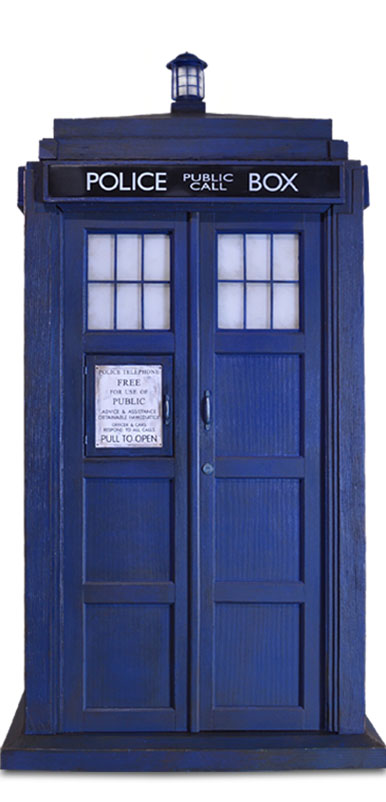

# Doctor Who's Police Box



## Objectives
Doctor Who's Police Box is a T.A.R.D.I.S (Time and Relative Dimension In Space), a fantastical space ship that can fly through time and space and other mind-bending-ly impossible situations. It can go _anywhere_.

Help T.A.R.D.I.S. navigate through a React App in the form of an object

```js
const tardis = {
  name: 'Time and Relative Dimension in Space',
  caps: false,
}
```

## Thinking in React
- By now, it should be pretty obvious that React is a pretty different approach than using server side templating.

- Read over
[Thinking in React](https://triplebyte.com/blog/how-to-think-in-react)

## Set Up

Use Create React App:
- `npx create-react-app tardis` or use a React Template at CodeSandBox.io
- `cd tardis`
- `npm start` to run development server (will be running automatically in codesandbox)

Add some css.

Every div will have a blue border and have some space around it for easy distinction between divs.

Put this css in src/App.css (double check that it is imported in App.js)

```css
@import url('https://fonts.googleapis.com/css?family=Poppins');

body {
  margin: 1em;
  padding: 1em;
  font-family: 'Poppins', sans-serif;
  background: #FEFFE9;
  text-align: center;
}


div{
  margin: auto;
  width: 80%;
  box-shadow: 0 0 8px dodgerblue;
  padding: 1em;
  background: white;
}
```


## Top Level
- One `div`, that is already hard coded in the html

## App Level
- Create an `App` component class
- Create a variable in the App component that is "State" (if you want to learn more or review state watch => [This Video](https://www.youtube.com/watch?v=jGvAPfCRqUU))

```js
// Import the useState hook
import {useState} from "react"

function App(props){

  // variable to be used as the initial value of our state
  const tardis = {
  name: 'Time and Relative Dimension in Space',
  caps: false,
  }

  // creating our state, using tardis as the initial value
  // state is the variable that holds the data
  // set state is a function to update the state
  const [state, setState] = useState(tardis)

}

```

- render a `div`

```js
// Import the useState hook
import {useState} from "react"

function App(props){

  // variable to be used as the initial value of our state
  const tardis = {
  name: 'Time and Relative Dimension in Space',
  caps: false,
  }

  // creating our state, using tardis as the initial value
  // state is the variable that holds the data
  // set state is a function to update the state
  const [state, setState] = useState(tardis)

  // The return value which is the JSX/HTML the component renders
  return <div></div>

}

export default App

```

- inside the `div`, put an `h3` that will render the `name` property from `tardis`

```js
// Import the useState hook
import {useState} from "react"

function App(props){

  // variable to be used as the initial value of our state
  const tardis = {
  name: 'Time and Relative Dimension in Space',
  caps: false,
  }

  // creating our state, using tardis as the initial value
  // state is the variable that holds the data
  // set state is a function to update the state
  const [state, setState] = useState(tardis)

  // The return value which is the JSX/HTML the component renders
  return <div><h3>{state.name}</h3></div>

}

export default App

```

- If you do not have the React dev tools chrome extension, download it and open it in dev tools to inspect the components data

Check your State in React Dev Tools:


- Add a function that gets called on click and changes the text

```js
// Import the useState hook
import {useState} from "react"

function App(props){

  // variable to be used as the initial value of our state
  const tardis = {
  name: 'Time and Relative Dimension in Space',
  caps: false,
  }

  // creating our state, using tardis as the initial value
  // state is the variable that holds the data
  // set state is a function to update the state
  const [state, setState] = useState(tardis)

  // Function that will update the state to all call caps or all lowercase

  const updateCapitalization = () => {
    // create a new object to replace state, it's name property will be capitalized based the current states caps property
    // If state.caps is true, lowercase the name, if not, uppercase the name
    const newState = {
    name: state.caps ? state.name.toLowercase() : state.name.toUpperCase(),
    caps: false,
    }

    // Replace the current state with the new state, this triggers the component rebuilding itself to reflect changes
    setState(newState)
  }

  // The return value which is the JSX/HTML the component renders
  // The h3 now has a click event so it triggers the updateCapitalization function when clicked
  return <div><h3 onClick={updateCapitalization} >{state.name}</h3></div>

}

export default App

```

- On click, the text will change from caps to lower case and change the caps property.

- Look in devtools to see the change in state!

## New Components
- Create a new folder called components inside of source and create the following components.

### Create a New Class Component `DivOne`
- create a file file call src/components/DivOne.js
- have it render a div

```js
import React from "react"
// IMPORT THE DIVONE COMPONENT
import DivOne from "./components/DivOne"

function DivOne(props){

  return <div></div>
}

export default DivOne
```

- move the h3 to inside the div in this component
- work on passing the data from state down
- work on getting the click function work properly

<details><summary>Solution</summary>

- UPDATES TO APP.JS (Pass the function and name propery as props to DivOne)

```js

// Import the useState hook
import {useState} from "react"

function App(props){

  // variable to be used as the initial value of our state
  const tardis = {
  name: 'Time and Relative Dimension in Space',
  caps: false,
  }

  // creating our state, using tardis as the initial value
  // state is the variable that holds the data
  // set state is a function to update the state
  const [state, setState] = useState(tardis)

  // Function that will update the state to all call caps or all lowercase

  const updateCapitalization = () => {
    // create a new object to replace state, it's name property will be capitalized based the current states caps property
    // If state.caps is true, lowercase the name, if not, uppercase the name
    const newState = {
    name: state.caps ? state.name.toLowercase() : state.name.toUpperCase(),
    caps: false,
    }

    // Replace the current state with the new state, this triggers the component rebuilding itself to reflect changes
    setState(newState)
  }

  // The return value which is the JSX/HTML the component renders
  // we now pass the function and the name property as props to DivOne
  return <div><DivOne updateCapitalization={updateCapitalization} name={state.name}/></div>

}

export default App

```

- Final result of DivOne.js

```js
import React from "react"

// Now that App.js is rendering DivOne and sending it props, we can access those values through the props object under the names we pass them under in App.js 

function DivOne(props){

  return <div><h3 onClick={props.updateCapitalization} >{props.name}</h3></div>
}

export default DivOne
```


</details>

- Once this is completed, click on the h3 to make sure it still toggles capitalization
- Check React devtools and examine the data in the App and DivOne component

### Create a New Class Component `DivTwo`
- have it render a div
- move the h3 to inside the div in this component
- work on passing the data from DivOne down
- work on getting the click function to work properly

### Create a New Class Component `DivThree`
- have it render a div
- move the h3 to inside the div in this component
- work on passing the data from DivTwo down
- work on getting the click function to work properly


### Create another `DivThree` Inside `DivTwo`
- how should it render?
- will the function affect one or both divThrees?
- should it affect one or both?

<details><summary>Hint</summary>

```
The Data Flows Down
Neither parent nor child components can know if a certain component is stateful or stateless, and they shouldn’t care whether it is defined as a function or a class.

This is why state is often called local or encapsulated. It is not accessible to any component other than the one that owns and sets it.

A component may choose to pass its state down as props to its child components:
```
[Thinking in React: The Data Flows Down](https://reactjs.org/docs/state-and-lifecycle.html#adding-local-state-to-a-class)


</details>

- Thinking in React: where should state go? Topmost component possible? Bottom Most component possible? What is the best practice
- refactor your code so that each tardis is updating independent of the other one, if it isn't already

<details><summary>hint</summary>

To get both DivThree to act independantly, move the state and updateCapitalization functions over to the DivThree component so each DivThree instance has its own independant state.

- DivThree.js (Move the handling of State to DivThree)

```js


// Import the useState hook
import {useState} from "react"

function DivThree(props){

  // variable to be used as the initial value of our state
  const tardis = {
  name: 'Time and Relative Dimension in Space',
  caps: false,
  }

  // creating our state, using tardis as the initial value
  // state is the variable that holds the data
  // set state is a function to update the state
  const [state, setState] = useState(tardis)

  // Function that will update the state to all call caps or all lowercase

  const updateCapitalization = () => {
    // create a new object to replace state, it's name property will be capitalized based the current states caps property
    // If state.caps is true, lowercase the name, if not, uppercase the name
    const newState = {
    name: state.caps ? state.name.toLowercase() : state.name.toUpperCase(),
    caps: false,
    }

    // Replace the current state with the new state, this triggers the component rebuilding itself to reflect changes
    setState(newState)
  }


  return <div><h3 onClick={updateCapitalization}>{state.name}</h3></div>

}

export default DivThree


```


</details>


## Write it out (Write Answers/Reflections to the Below in a Answers.md)

Thinking in React means planning. Don't code the following, write it out on paper and pseudocode it - you don't have to turn it in, but it can really help. Some of the details are vague. If you're on the job and ended up with these vague details what would you do? Solve it on your own? Ask someone?

- Which doctor is traveling with us? The doctors are currently numbered 1- 13
- set a property `theDoctor` to render 1 inside the DivThree component - is this 'ok'? Or should this property go in App? Try to do some research to find out. Just because you can doesn't mean you should. And sometimes you should really follow best practices. Which are... what for react?

- When The Doctor is gravely injured he can regenerate rather than die and becomes the next doctor
- Write a function that increases The Doctor's number called `regenerate` (when and how is this function called?)
- Where does it go? In App? In DivThree? DivTwo?
- How do you pass this function around?
- Is there a way to call this function in the App Component if you've declared it further down?
- Just because you might be able to doesn't mean you should.
- What does Thinking in React mean?


- After considering the above, take time to read [Thinking in React](https://triplebyte.com/blog/how-to-think-in-react) again

Revisit:
- How is this different than Server Side Templating?
- What are the pros and cons?
- What are the best practices?
- Why do we build and refactor so much with React?
